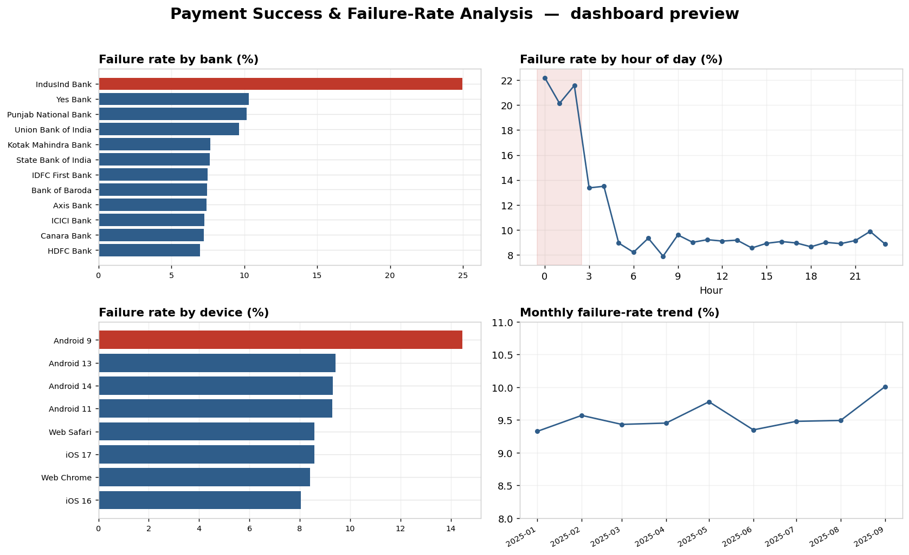
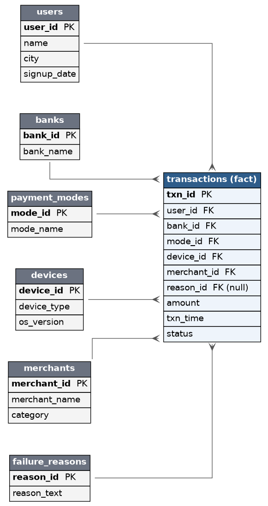

# Payment Success & Failure-Rate Analysis

An end-to-end SQL + dashboard project that digs into where online payments fail,
which bank / device / time combinations are the worst offenders, and how much
revenue those failures cost.

I built this to get hands-on with the analyst workflow I kept reading about in
job descriptions — model a relational schema, generate a realistic dataset, write
diagnostic SQL (window functions, `FILTER`, `LAG`), and put a dashboard on top of
it. The dataset is synthetic, but the failure patterns are engineered so the
analysis is a real investigation, not a coin toss.



> **Note on the data:** all 100,000 transactions are generated with `Faker`. The
> failure patterns (one bank failing more, an overnight spike, older devices
> failing more) are deliberately injected so there's something to discover. They
> do **not** represent any real bank or payment provider.

## Key findings

- Overall failure rate **9.52%**, worth **₹10.21 Cr** in failed transactions.
- One bank (IndusInd, in the synthetic data) fails **~25%** of the time vs ~7% for
  the healthiest banks.
- Failures spike to **~22%** in the 12am–3am window; the old Android build fails
  **14.5%** vs ~8% on iOS.
- Root cause pocket: **IndusInd + Android + 12–3am fails 76%** of the time, vs
  9.4% everywhere else.

Full write-up with the numbers behind each chart is in
[`docs/findings.md`](docs/findings.md).

## Schema

A star schema — one `transactions` fact table joined to six dimension tables.



## Tech stack

- **PostgreSQL** — data warehouse + all the analysis (window functions, `FILTER`)
- **Python** (`Faker`, `pandas`, `psycopg2`) — data generation and loading
- **Streamlit + Plotly** — interactive dashboard
- **VS Code** — where it was written

## Project structure

```
payment-failure-analysis/
├── data/                     # generated CSVs (created by the script)
├── sql/
│   ├── 01_schema.sql         # DDL: fact + 6 dimension tables, keys, indexes
│   └── 02_analysis.sql       # 11 diagnostic queries
├── scripts/
│   ├── generate_data.py      # Faker-based synthetic data generator
│   └── load_data.py          # bulk-loads the CSVs into Postgres via COPY
├── dashboard/
│   └── app.py                # Streamlit dashboard
├── docs/
│   ├── er_diagram.png        # schema diagram
│   ├── findings.md           # written analysis
│   └── dashboard_preview.png
├── requirements.txt
└── README.md
```

## How to run it

**1. Install dependencies**

```bash
pip install -r requirements.txt
```

**2. Generate the data**

```bash
python scripts/generate_data.py --rows 100000
```

Writes seven CSVs into `data/`.

**3. Load into Postgres**

Create a database (locally, or a free one on Neon / Supabase), then point the
loader at it and run it. It creates the schema and bulk-loads every table:

```bash
export PGHOST=localhost PGDATABASE=payments PGUSER=your_user PGPASSWORD=your_pw
python scripts/load_data.py
```

(You can also set a single `DATABASE_URL` instead of the `PG*` variables.)

**4. Run the analysis queries**

```bash
psql -d payments -f sql/02_analysis.sql
```

**5. Launch the dashboard**

```bash
streamlit run dashboard/app.py
```

The dashboard reads the CSVs directly, so it works even without the database
running — which also makes it easy to deploy to Streamlit Community Cloud for a
live link.

## Notes / things I'd add next

- Split the transactions into monthly partitions to practice partition pruning.
- Add a `dbt` layer for the aggregate models instead of raw SQL files.
- Wire the dashboard to query Postgres live instead of reading CSVs.
